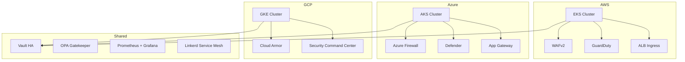

# Multi-Cloud DevSecOps Platform

> **ITA**: Piattaforma DevSecOps multi-cloud per il provisioning e la gestione di cluster Kubernetes sicuri su AWS, Azure e GCP, con gestione centralizzata dei segreti, policy enforcement e osservabilita.
>
> **EN**: Multi-cloud DevSecOps platform for provisioning and managing secure Kubernetes clusters on AWS, Azure, and GCP, with centralized secrets management, policy enforcement, and observability.

---

## Architecture / Architettura



## Features / Funzionalita

| Feature | Description (EN) | Descrizione (ITA) |
|---------|------------------|--------------------|
| **Multi-Cloud K8s** | EKS + AKS + GKE with consistent configuration | EKS + AKS + GKE con configurazione coerente |
| **Secrets Management** | HashiCorp Vault in HA with auto-unseal | HashiCorp Vault in HA con auto-unseal |
| **Policy Enforcement** | OPA Gatekeeper with custom constraints | OPA Gatekeeper con vincoli personalizzati |
| **Service Mesh** | Linkerd for mTLS and observability | Linkerd per mTLS e osservabilita |
| **Monitoring** | Prometheus + Grafana + Alertmanager | Prometheus + Grafana + Alertmanager |
| **Security Scanning** | WAFv2, GuardDuty, Defender, Cloud Armor | WAFv2, GuardDuty, Defender, Cloud Armor |
| **CI/CD** | GitHub Actions with drift detection | GitHub Actions con rilevamento drift |
| **IaC Security** | tfsec, checkov, tflint in pre-commit | tfsec, checkov, tflint in pre-commit |

---

## Prerequisites / Prerequisiti

**ITA**: Assicurarsi di avere installato e configurato i seguenti strumenti prima di procedere.

**EN**: Ensure the following tools are installed and configured before proceeding.

| Tool | Version | Purpose |
|------|---------|---------|
| Terraform | >= 1.7.0 | Infrastructure provisioning |
| Terragrunt | >= 0.55.0 | Configuration orchestration |
| kubectl | >= 1.29.0 | Kubernetes CLI |
| Helm | >= 3.14.0 | Kubernetes package manager |
| AWS CLI | >= 2.x | AWS authentication |
| Azure CLI | >= 2.x | Azure authentication |
| gcloud CLI | >= 460.0 | GCP authentication |
| tflint | >= 0.50.0 | Terraform linting |
| tfsec | >= 1.28.0 | Terraform security scanning |
| checkov | >= 3.x | Policy-as-code scanning |
| pre-commit | >= 3.x | Git hooks framework |
| Docker | >= 24.x | Container runtime (optional) |

### Cloud Authentication / Autenticazione Cloud

```bash
# AWS
aws configure --profile devsecops
export AWS_PROFILE=devsecops

# Azure
az login
az account set --subscription <SUBSCRIPTION_ID>

# GCP
gcloud auth application-default login
gcloud config set project <PROJECT_ID>
```

---

## Project Structure / Struttura del Progetto

```
terraform-multi-cloud-devsecops/
├── .github/workflows/       # CI/CD pipelines
├── environments/
│   ├── dev/                 # Development environment
│   ├── stg/                 # Staging environment
│   └── prd/                 # Production environment
├── modules/
│   ├── aws/                 # AWS-specific modules
│   │   ├── eks/             # EKS cluster
│   │   ├── networking/      # VPC, subnets, NAT
│   │   ├── security/        # WAF, GuardDuty, Config
│   │   └── ingress/         # ALB controller, cert-manager
│   ├── azure/               # Azure-specific modules
│   │   ├── aks/             # AKS cluster
│   │   ├── networking/      # VNet, firewall
│   │   ├── security/        # Defender, Key Vault
│   │   └── ingress/         # AGIC, cert-manager
│   ├── gcp/                 # GCP-specific modules
│   │   ├── gke/             # GKE cluster
│   │   ├── networking/      # VPC, Cloud NAT
│   │   ├── security/        # Cloud Armor, SCC
│   │   └── ingress/         # Nginx ingress, cert-manager
│   └── shared/              # Cross-cloud modules
│       ├── vault/           # HashiCorp Vault HA
│       ├── gatekeeper/      # OPA Gatekeeper + policies
│       ├── monitoring/      # Prometheus + Grafana
│       └── service-mesh/    # Linkerd
├── terragrunt.hcl           # Root Terragrunt config
├── Makefile                 # Build automation
├── Dockerfile               # Workspace image
└── .pre-commit-config.yaml  # Pre-commit hooks
```

---

## Environment Sizing / Dimensionamento Ambienti

| Resource | Dev | Staging | Production |
|----------|-----|---------|------------|
| **AWS EKS** | | | |
| Node count | 1 | 2 | 3-10 (autoscale) |
| Instance type | t3.medium | t3.large | m5.xlarge |
| Multi-AZ | No | Yes | Yes |
| **Azure AKS** | | | |
| Node count | 1 | 2 | 3-10 (autoscale) |
| VM size | Standard_B2s | Standard_D2s_v3 | Standard_D4s_v3 |
| Availability zones | 1 | 2 | 3 |
| **GCP GKE** | | | |
| Node count | 1 | 2 | 3-10 (autoscale) |
| Machine type | e2-medium | e2-standard-2 | e2-standard-4 |
| Regional | No (zonal) | Yes | Yes |
| **Vault** | 1 replica | 3 replicas | 5 replicas (HA) |
| **Monitoring** | Minimal retention | 7d retention | 30d retention |
| **Estimated Cost/mo** | ~$300 | ~$1,200 | ~$5,000+ |

---

## Quick Start / Avvio Rapido

### Option A: Docker Workspace / Spazio di lavoro Docker

```bash
# Build and run the workspace container
# Compilare e avviare il container
make docker-build
make docker-run
```

### Option B: Local Setup / Configurazione Locale

**ITA**: Seguire i passaggi sottostanti per configurare ed eseguire il deploy dell'ambiente desiderato.

**EN**: Follow the steps below to configure and deploy the desired environment.

```bash
# 1. Clone the repository / Clonare il repository
git clone <repo-url>
cd terraform-multi-cloud-devsecops

# 2. Install pre-commit hooks / Installare gli hook pre-commit
pre-commit install

# 3. Copy and edit tfvars / Copiare e modificare i tfvars
cp environments/dev/terraform.tfvars.example environments/dev/terraform.tfvars
vim environments/dev/terraform.tfvars

# 4. Initialize and plan / Inizializzare e pianificare
make init ENV=dev
make plan ENV=dev

# 5. Apply / Applicare
make apply ENV=dev

# 6. Get kubeconfig / Ottenere kubeconfig
make kubeconfig-aws ENV=dev
make kubeconfig-azure ENV=dev
make kubeconfig-gcp ENV=dev
```

### Deploy Steps / Passaggi di Deploy

1. **Network Layer** - VPC/VNet/Subnets are provisioned first
2. **Security Layer** - WAF, Firewall, Cloud Armor rules
3. **Kubernetes Clusters** - EKS, AKS, GKE with secure defaults
4. **Shared Services** - Vault, Gatekeeper, Monitoring, Service Mesh
5. **Ingress Layer** - Load balancers, DNS, TLS certificates

---

## CI/CD Pipeline

The GitHub Actions workflow performs:

- **On Pull Request**: `terraform fmt`, `validate`, `tfsec`, `checkov`, `plan`, Infracost cost estimation
- **On Merge to main**: `terraform apply` with approval gates
- **Scheduled**: Daily drift detection at 06:00 UTC

---

## Security / Sicurezza

**ITA**: La sicurezza e integrata in ogni livello della piattaforma.

**EN**: Security is integrated at every layer of the platform.

- All clusters use private endpoints
- Network policies enforced via Gatekeeper
- mTLS between services via Linkerd
- Secrets managed by Vault with auto-rotation
- WAF/Firewall at the edge
- Container image scanning in CI
- RBAC with least-privilege principle
- Encryption at rest and in transit

---

## Cleanup / Pulizia

```bash
# Destroy a specific environment / Distruggere un ambiente specifico
make destroy ENV=dev

# Clean local cache / Pulire la cache locale
make clean
```

---

## License

MIT License. See [LICENSE](LICENSE) for details.
