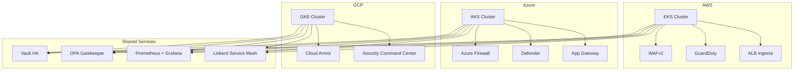
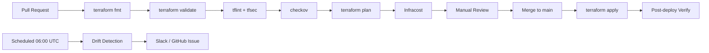

# Multi-Cloud DevSecOps Platform

> **ITA**: Piattaforma DevSecOps multi-cloud per il provisioning e la gestione di cluster Kubernetes sicuri su AWS, Azure e GCP, con gestione centralizzata dei segreti (Vault), policy enforcement (OPA Gatekeeper), osservabilita (Prometheus/Grafana) e service mesh (Linkerd).
>
> **EN**: Multi-cloud DevSecOps platform for provisioning and managing secure Kubernetes clusters on AWS, Azure, and GCP, with centralized secrets management (Vault), policy enforcement (OPA Gatekeeper), observability (Prometheus/Grafana), and service mesh (Linkerd).

[](https://www.terraform.io/)
[](LICENSE)
[](https://github.com/GiulioSavini/terraform-multi-cloud-devsecops/actions)

---

## Architecture / Architettura



---

## Features / Funzionalita

| Feature | Description (EN) | Descrizione (ITA) |
|---------|------------------|--------------------|
| **Multi-Cloud K8s** | EKS + AKS + GKE with consistent configuration | EKS + AKS + GKE con configurazione coerente |
| **Secrets Management** | HashiCorp Vault in HA with auto-unseal | HashiCorp Vault in HA con auto-unseal |
| **Policy Enforcement** | OPA Gatekeeper with custom constraints | OPA Gatekeeper con vincoli personalizzati |
| **Service Mesh** | Linkerd for mTLS and observability | Linkerd per mTLS e osservabilita |
| **Monitoring** | Prometheus + Grafana + Alertmanager | Prometheus + Grafana + Alertmanager |
| **Security Scanning** | WAFv2, GuardDuty, Defender, Cloud Armor | WAFv2, GuardDuty, Defender, Cloud Armor |
| **CI/CD** | GitHub Actions with drift detection | GitHub Actions con rilevamento drift |
| **IaC Security** | tfsec, checkov, tflint in pre-commit | tfsec, checkov, tflint in pre-commit |

---

## Quick Start (One Command)

The fastest way to deploy the entire platform:

```bash
git clone https://github.com/GiulioSavini/terraform-multi-cloud-devsecops.git
cd terraform-multi-cloud-devsecops

./scripts/bootstrap.sh dev
```

`bootstrap.sh` performs the following steps automatically:

1. Validates that all prerequisite tools are installed (`validate-prereqs.sh`)
2. Detects and exports required variables (`get-variables.sh`)
3. Provisions remote state backends on all three clouds (`setup-backend.sh`)
4. Runs `terraform init`, `plan`, and `apply` for the target environment
5. Retrieves kubeconfig for every provisioned cluster

---

## Manual Setup

### Prerequisites

Ensure the following tools are installed and configured before proceeding.

| Tool | Minimum Version | Purpose |
|------|-----------------|---------|
| Terraform | >= 1.7.0 | Infrastructure provisioning |
| AWS CLI | >= 2.x | AWS authentication and resource management |
| Azure CLI | >= 2.x | Azure authentication and resource management |
| gcloud CLI | >= 460.0 | GCP authentication and resource management |
| kubectl | >= 1.29.0 | Kubernetes cluster management |
| Helm | >= 3.14.0 | Kubernetes package manager |
| Terragrunt | >= 0.55.0 | Configuration orchestration (optional) |
| tflint | >= 0.50.0 | Terraform linting |
| tfsec | >= 1.28.0 | Terraform security scanning |
| checkov | >= 3.x | Policy-as-code scanning |
| pre-commit | >= 3.x | Git hooks framework |
| Docker | >= 24.x | Container runtime (optional) |

### Validate Prerequisites

```bash
./scripts/validate-prereqs.sh
```

This script checks that every required CLI tool is installed and meets the minimum version.

### Step-by-Step Deployment

```bash
# 1. Authenticate to all three clouds
aws configure --profile devsecops
export AWS_PROFILE=devsecops

az login
az account set --subscription <SUBSCRIPTION_ID>

gcloud auth application-default login
gcloud config set project <PROJECT_ID>

# 2. Export environment variables
source ./scripts/get-variables.sh

# 3. Provision remote state backends (S3, Azure Storage, GCS)
./scripts/setup-backend.sh

# 4. Install pre-commit hooks
pre-commit install

# 5. Copy and edit tfvars for your environment
cp environments/dev/terraform.tfvars.example environments/dev/terraform.tfvars
vim environments/dev/terraform.tfvars

# 6. Initialize and plan
make init ENV=dev
make plan ENV=dev

# 7. Apply infrastructure
make apply ENV=dev

# 8. Retrieve kubeconfig for all clusters
make kubeconfig-aws ENV=dev
make kubeconfig-azure ENV=dev
make kubeconfig-gcp ENV=dev
```

---

## Scripts Reference

All automation scripts are located in the `scripts/` directory.

| Script | Description |
|--------|-------------|
| `bootstrap.sh` | End-to-end deployment in a single command. Usage: `./scripts/bootstrap.sh <env>` |
| `validate-prereqs.sh` | Checks that all required CLI tools are installed and at the correct version |
| `get-variables.sh` | Detects cloud account/project IDs and exports them as environment variables |
| `setup-backend.sh` | Provisions remote Terraform state backends (S3, Azure Storage Account, GCS bucket) |
| `destroy-all.sh` | Tears down all infrastructure across all clouds for a given environment |

---

## Examples

Ready-to-use example configurations are provided in the `examples/` directory.

| Example | Description | Usage |
|---------|-------------|-------|
| `complete` | Full multi-cloud deployment (EKS + AKS + GKE + all shared services) | `cd examples/complete && terraform init && terraform apply` |
| `aws-eks-only` | AWS-only deployment with EKS, WAFv2, and GuardDuty | `cd examples/aws-eks-only && terraform init && terraform apply` |
| `azure-aks-only` | Azure-only deployment with AKS, Firewall, and Defender | `cd examples/azure-aks-only && terraform init && terraform apply` |
| `gcp-gke-only` | GCP-only deployment with GKE, Cloud Armor, and SCC | `cd examples/gcp-gke-only && terraform init && terraform apply` |
| `shared-tools` | Shared services only (Vault, Gatekeeper, Prometheus, Linkerd) on an existing cluster | `cd examples/shared-tools && terraform init && terraform apply` |

---

## Environment Sizing

| Resource | Dev | Staging | Production |
|----------|-----|---------|------------|
| **AWS EKS** | | | |
| Instance type | t3.medium | t3.large | m5.xlarge |
| Node count | 1 | 2 | 3-10 (autoscale) |
| Multi-AZ | No | Yes | Yes |
| **Azure AKS** | | | |
| VM size | Standard_B2s | Standard_D2s_v3 | Standard_D4s_v3 |
| Node count | 1 | 2 | 3-10 (autoscale) |
| Availability zones | 1 | 2 | 3 |
| **GCP GKE** | | | |
| Machine type | e2-medium | e2-standard-2 | e2-standard-4 |
| Node count | 1 | 2 | 3-10 (autoscale) |
| Regional | No (zonal) | Yes | Yes |
| **Vault** | 1 replica | 3 replicas | 5 replicas (HA) |
| **Monitoring** | Minimal retention | 7d retention | 30d retention |
| **Estimated Cost/mo** | ~$300 | ~$1,200 | ~$5,000+ |

---

## Project Structure

```
terraform-multi-cloud-devsecops/
├── .github/
│   └── workflows/
│       ├── terraform.yml          # Main CI/CD pipeline
│       └── drift-detection.yml    # Scheduled drift detection
├── scripts/
│   ├── bootstrap.sh               # One-command deployment
│   ├── validate-prereqs.sh        # Prerequisite validation
│   ├── get-variables.sh           # Environment variable detection
│   ├── setup-backend.sh           # Remote state backend provisioning
│   └── destroy-all.sh             # Full teardown
├── environments/
│   ├── dev/                       # Development environment
│   ├── stg/                       # Staging environment
│   └── prd/                       # Production environment
├── modules/
│   ├── aws/
│   │   ├── eks/                   # EKS cluster
│   │   ├── networking/            # VPC, subnets, NAT
│   │   ├── security/              # WAF, GuardDuty, Config
│   │   └── ingress/               # ALB controller, cert-manager
│   ├── azure/
│   │   ├── aks/                   # AKS cluster
│   │   ├── networking/            # VNet, firewall
│   │   ├── security/              # Defender, Key Vault
│   │   └── ingress/               # AGIC, cert-manager
│   ├── gcp/
│   │   ├── gke/                   # GKE cluster
│   │   ├── networking/            # VPC, Cloud NAT
│   │   ├── security/              # Cloud Armor, SCC
│   │   └── ingress/               # Nginx ingress, cert-manager
│   └── shared/
│       ├── vault/                 # HashiCorp Vault HA
│       ├── gatekeeper/            # OPA Gatekeeper + policies
│       ├── monitoring/            # Prometheus + Grafana
│       └── service-mesh/          # Linkerd
├── examples/
│   ├── complete/                  # Full multi-cloud example
│   ├── aws-eks-only/              # AWS-only example
│   ├── azure-aks-only/            # Azure-only example
│   ├── gcp-gke-only/              # GCP-only example
│   └── shared-tools/              # Shared services example
├── terragrunt.hcl                 # Root Terragrunt configuration
├── Makefile                       # Build automation
├── Dockerfile                     # Workspace image
├── CONTRIBUTING.md                # Contribution guidelines
├── SECURITY.md                    # Security policy
├── CHANGELOG.md                   # Release changelog
├── LICENSE                        # MIT License
└── .pre-commit-config.yaml        # Pre-commit hooks
```

---

## Makefile Commands

All commands accept an `ENV` parameter (default: `dev`). Usage: `make <target> ENV=<dev|stg|prd>`

### Terraform

| Command | Description |
|---------|-------------|
| `make init` | Initialize Terraform for the given environment |
| `make plan` | Run Terraform plan |
| `make apply` | Apply the Terraform plan |
| `make destroy` | Destroy infrastructure for the given environment |

### Terragrunt

| Command | Description |
|---------|-------------|
| `make tg-init` | Initialize with Terragrunt |
| `make tg-plan` | Plan with Terragrunt |
| `make tg-apply` | Apply with Terragrunt |
| `make tg-destroy` | Destroy with Terragrunt |
| `make tg-plan-all` | Plan all environments |
| `make tg-apply-all` | Apply all environments |

### Quality and Security

| Command | Description |
|---------|-------------|
| `make fmt` | Format all Terraform files |
| `make validate` | Validate Terraform configuration |
| `make lint` | Run TFLint across all modules |
| `make sec` | Run security scans (tfsec + checkov) |

### Utilities

| Command | Description |
|---------|-------------|
| `make docs` | Generate Terraform documentation for all modules |
| `make cost` | Estimate costs with Infracost |
| `make clean` | Remove Terraform cache, plans, and lock files |
| `make kubeconfig-aws` | Retrieve EKS kubeconfig |
| `make kubeconfig-azure` | Retrieve AKS kubeconfig |
| `make kubeconfig-gcp` | Retrieve GKE kubeconfig |
| `make docker-build` | Build the workspace Docker image |
| `make docker-run` | Run the workspace container |
| `make help` | Show all available targets |

---

## Teardown

To destroy all infrastructure across all three clouds for a given environment:

```bash
./scripts/destroy-all.sh dev
```

This script tears down resources in the correct dependency order:

1. Shared services (Linkerd, Prometheus, Gatekeeper, Vault)
2. Kubernetes clusters (EKS, AKS, GKE)
3. Security layer (WAF, Firewall, Cloud Armor)
4. Networking layer (VPC, VNet, subnets)
5. Remote state backends (optional, with `--include-backends` flag)

To destroy a single environment via Make:

```bash
make destroy ENV=dev
```

---

## CI/CD Pipeline

### Workflow Diagram



### Required GitHub Secrets

| Secret | Description |
|--------|-------------|
| `AWS_ACCESS_KEY_ID` | AWS IAM access key for Terraform |
| `AWS_SECRET_ACCESS_KEY` | AWS IAM secret key for Terraform |
| `AWS_REGION` | AWS region (e.g., `eu-west-1`) |
| `ARM_CLIENT_ID` | Azure Service Principal client ID |
| `ARM_CLIENT_SECRET` | Azure Service Principal client secret |
| `ARM_SUBSCRIPTION_ID` | Azure subscription ID |
| `ARM_TENANT_ID` | Azure AD tenant ID |
| `GCP_PROJECT_ID` | GCP project ID |
| `GCP_SA_KEY` | GCP service account key (JSON, base64-encoded) |
| `INFRACOST_API_KEY` | Infracost API key for cost estimation |
| `TF_STATE_ENCRYPTION_KEY` | Encryption key for remote state (optional) |

---

## Security Best Practices

This platform implements defense-in-depth across every layer:

- **Private Endpoints**: All Kubernetes API servers use private endpoints; no public access by default
- **Network Policies**: OPA Gatekeeper enforces network segmentation and pod security standards
- **mTLS Everywhere**: Linkerd service mesh provides mutual TLS between all services automatically
- **Secrets Rotation**: Vault manages all secrets with automatic rotation and short-lived dynamic credentials
- **Edge Protection**: WAFv2 (AWS), Azure Firewall (Azure), and Cloud Armor (GCP) protect ingress traffic
- **Container Scanning**: CI pipeline scans container images for vulnerabilities before deployment
- **Least Privilege RBAC**: Kubernetes RBAC and cloud IAM follow the principle of least privilege
- **Encryption**: Data encrypted at rest (KMS/Key Vault/Cloud KMS) and in transit (TLS 1.3)
- **Audit Logging**: CloudTrail, Azure Activity Log, and Cloud Audit Logs enabled across all accounts
- **Pre-commit Hooks**: tfsec, checkov, and tflint run locally before every commit
- **Drift Detection**: Automated daily checks ensure deployed infrastructure matches the declared state
- **Immutable Infrastructure**: Cluster nodes use hardened, read-only OS images where supported

---

## Contributing

Contributions are welcome. Please read [CONTRIBUTING.md](CONTRIBUTING.md) for guidelines on:

- Code style and formatting conventions
- Pull request process and review expectations
- How to report bugs and request features
- Local development setup

---

## License

This project is licensed under the MIT License. See [LICENSE](LICENSE) for details.
